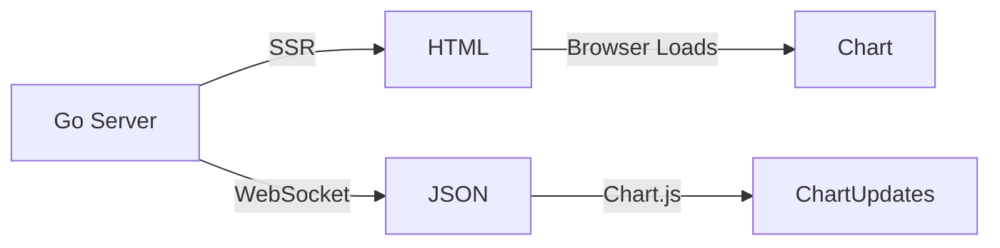

# Mock Stock Price Chart with Go and Templ

1. Set Up the Backbone 🧑‍🍳
Created a Go program that acts like a chef—it cooks up a website and keeps sending new stock prices every second, Go's `templ` package generates the full HTML page (with the chart container, scripts, and styles) on the server and sends it to the browser.

2.  Real-Time Magic ☎️
Added a special phone line (WebSocket) between your browser and the Go server, so price updates happen instantly without refreshing the page, After the initial page load, WebSocket sends raw JSON data to the browser. JavaScript (Chart.js) updates the chart dynamically without full page reloads.

3. Fake Stock Data Generator 🔢
Made a pretend stock market that randomly changes prices in a realistic way (up/down swings), starting at $100.

4. Chart Display 📈
Used a free charting tool (Chart.js) to draw a line that wiggles with each new price. Added titles and styling to make it look professional.

## Flowchart



## Quick start: 

```go 
templ generate && go run main.go
```
## Chart Visualization


## Links to resources

1. Creating a simple template component in Go --> [link](https://templ.guide/quick-start/creating-a-simple-templ-component)
2. Static Rendering with templ --> [link](https://templ.guide/static-rendering/blog-example)
3. Example counter application --> [link](https://templ.guide/server-side-rendering/example-counter-application)